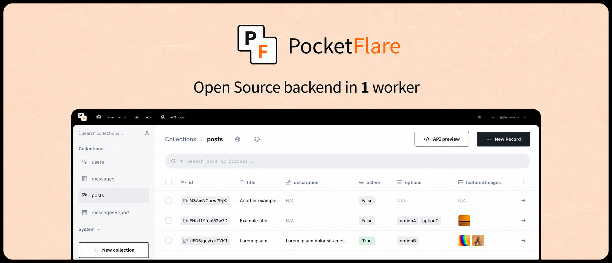

Pocketflare runs [PocketBase] on Cloudflare Workers and includes:

- D1-backed [PocketBase] data instead of an embedded SQLite file
- realtime subscriptions through an optional Durable Object bridge
- built-in files and users management, with file storage backed by R2
- the familiar [PocketBase] Admin dashboard UI, served through Workers Assets
- the simple REST-ish [PocketBase] API, running as Go WASM on Cloudflare Workers

Pocketflare is a thin [PocketBase] port for Cloudflare, structured to keep upstream updates easy to pull.

## Compatibility Model

Pocketflare preserves the [PocketBase] API and runtime shape where Cloudflare provides equivalent primitives. PocketBase file fields work through Pocketflare's R2-backed filesystem adapter. Custom Go code that uses PocketBase's file APIs should continue to use those APIs and will store files in R2.

Pocketflare does not turn arbitrary local filesystem, fsnotify, subprocess, or raw socket code into Worker-compatible code. Apps that read and write files directly with `os.*` should move those paths to PocketBase file APIs, R2 bindings, or another Worker-compatible service.

D1 is the default database backend because it is cheap, highly available, and operationally simple. Durable Object SQLite is available as an opt-in mode for apps that need upstream-style SQLite transactions.

## Quick Start

Scaffold a new Pocketflare project:

```sh
./scripts/scaffold-project.sh
```

The scaffold prompts for the target directory, Go module path, Worker name, app URL, database mode, R2 buckets, and whether to create Cloudflare resources through Wrangler. D1 mode also prompts for D1 database names and IDs. It does not write admin passwords to tracked files.

In the generated project:

```sh
./scripts/update-pb.sh
pnpm install
make deploy
```

## Local Development

Wrangler local dev runs the Worker in Miniflare and stores local D1/R2 state under `.wrangler/`.

From a fresh checkout:

```sh
./scripts/update-pb.sh
pnpm install
make build
make dev
```

Then open:

```text
http://localhost:8787/_pf
```

`/_pf` is Pocketflare's first-run setup route. If the local database has no superuser, it redirects to [PocketBase]'s tokenized first-access installer. After creating the superuser, use `http://localhost:8787/_/` for the admin UI. Local D1/R2 data is separate from Cloudflare remote resources.

After changing Go, `worker.mjs`, `runtime.mjs`, `realtime-do.mjs`, or `smtp-transport.mjs`, stop Wrangler, run `make build`, then run `make dev` again. Admin UI changes require rebuilding `admin-ui/_` before `make build`.

To test against real Cloudflare D1/R2 bindings instead of local Miniflare state:

```sh
make build
pnpm exec wrangler dev --remote
```

Use a deployed Worker for cold-start, concurrent-browser-request, and edge-runtime validation.

To check whether the pinned [PocketBase] version is current:

```sh
pnpm run check:pb-version
```

Run the critical local proof lane before calling a change done:

```sh
make proof-critical
```

That runs build, PocketBase version check, fresh patch replay, deploy dry-run, restore, D1 bootstrap, DO SQLite chained views, R2 copy, and cron proofs. Use `pnpm run proof:critical:remote` when you also need deployed-Worker D1 edge fixtures and production realtime proofs.

## Admin Setup

For a fresh database, deploy and open `/_pf`. Pocketflare redirects to [PocketBase]'s tokenized first-access installer, where you create the first superuser. After setup, use `/_/` for the normal [PocketBase] admin UI.

For headless bootstrap, set `POCKETFLARE_ADMIN_EMAIL` and `POCKETFLARE_ADMIN_PASSWORD` in the Worker environment. Remove those values after the first successful boot.

New databases also default:

- app URL from `POCKETFLARE_APP_URL`
- trusted proxy header `CF-Connecting-IP`

## Runtime Shape

Pocketflare runs [PocketBase] as Go WASM inside a Cloudflare Worker.

| Component | Cloudflare primitive | Purpose |
|---|---|---|
| Dynamic API | Worker + Go WASM | Runs [PocketBase] routes, hooks, auth, collections, and admin APIs. |
| App database | D1 `APP_DB` by default, or `APP_DO` in DO SQLite mode | Primary [PocketBase] data. |
| Logs database | D1 `LOGS_DB` by default, or `APP_DO` in DO SQLite mode | [PocketBase] logs and auxiliary data. |
| File storage | R2 `STORAGE` | Uploaded files for [PocketBase] file fields. |
| Backup artifacts | R2 `BACKUPS` | Stores upstream backup zip artifacts when enabled. |
| Admin UI assets | Workers Assets `ASSETS` | Serves `admin-ui/_` without booting Go WASM. |
| Realtime | Optional Durable Object | SSE/WebSocket bridge for [PocketBase] realtime. |

D1 mode bindings in `wrangler.toml`:

```toml
[[d1_databases]]
binding = "APP_DB"

[[d1_databases]]
binding = "LOGS_DB"

[[r2_buckets]]
binding = "STORAGE"

[[r2_buckets]]
binding = "BACKUPS"

[assets]
directory = "./admin-ui"
binding = "ASSETS"
```

`STORAGE`, `BACKUPS`, and `ASSETS` are used in both database modes. `ASSETS` is Cloudflare Workers Assets, not R2. It serves `admin-ui/_` without booting Go WASM. `/_pf` is the first-superuser setup route; `/_` and nested admin assets stay on Workers Assets.

## Database Modes

`d1` is the default:

```toml
[vars]
POCKETFLARE_DB_MODE = "d1"
```

It uses `APP_DB` and `LOGS_DB` D1 bindings. Fixed write transactions are atomic through `D1Database.batch()`. Interactive read-after-write transactions are not available on D1.
PocketBase migrations run without an outer transaction on D1 because older upstream migrations read their own writes.

`do_sqlite` is opt-in:

```toml
[vars]
POCKETFLARE_DB_MODE = "do_sqlite"

[[durable_objects.bindings]]
name = "APP_DO"
class_name = "AppDO"

[[migrations]]
tag = "v1"
new_sqlite_classes = ["AppDO"]
```

In this mode all dynamic requests route through one SQLite-backed Durable Object. It is the closer match for upstream [PocketBase] transaction behavior. Tradeoffs: the app database is single-object scoped, storage limits differ from D1, and latency depends on the Durable Object location. R2 file storage is unchanged.

| | D1 (default) | DO SQLite |
|---|---|---|
| **Transactions** | Fixed write batches via `D1Database.batch()`; no interactive read-after-write | Upstream SQLite semantics with write transactions |
| **Backup/Restore** | D1 Time Travel + export; restore via Pocketflare backup zip import | Cloudflare DO SQLite PITR exists, but Pocketflare does not expose an operator lane yet; restore via backup zip import |
| **Storage limit** | Higher (scales with D1 plan) | 1 GB Free / 10 GB Paid per DO |
| **Latency** | Global read replicas (reads are fast everywhere) | Single-location DO; latency varies by client proximity |
| **Cost** | Cheapest default | DO request + duration + storage billing |
| **Migration from D1** | N/A | Not a config flip; requires backup zip restore or data export/import |

Existing D1 apps do not switch to DO SQLite by flipping env vars; they require migration/import.

## File Storage

In the Workers build, Pocketflare injects an R2 filesystem adapter and ignores the upstream local/S3 filesystem path for file storage.

This adapter covers PocketBase-managed file fields and PocketBase filesystem calls. It does not provide a general writable POSIX filesystem for custom Go code.

Standard [PocketBase] file uploads and downloads are still mediated by the [PocketBase] API. Direct browser-to-R2 uploads and signed R2 download redirects are possible future Pocketflare features, not effects of enabling [PocketBase] S3.

Terminology:

- Upload means a [PocketBase] client posts a file to the [PocketBase] API, then Pocketflare writes it to R2. The current writer is a chunked R2 multipart writer: it buffers up to one part in Go, uploads that part, and releases it. This is bounded-memory pseudo-streaming, not direct browser-to-R2 upload.
- Download means [PocketBase] serves `/api/files/...` through the Worker from R2. Signed R2 redirects and public-bucket delivery are not implemented.
- Copy means [PocketBase]'s filesystem `Copy(src, dst)` method duplicates an existing object. Normal uploads, downloads, and migration imports do not use S3 `CopyObject`.

Copy relays the source object body to a new R2 object through the Worker without holding the whole file in Go memory. The path is runtime-proven up to 20 MiB via `scripts/proof-copy.sh`. Server-side R2 S3 `CopyObject` was tested with scoped credentials and disposable deployed Workers, but Workers rejected `r2.cloudflarestorage.com` fetch URLs before HTTP, so that optimization is disabled.

## Backups and Restore

### Cloudflare-Native Backups

Pocketflare does not build a new backup system. Ongoing backups use Cloudflare-native primitives:

- **D1:** D1 Time Travel for point-in-time restore, D1 export for backup retention beyond the Time Travel window.
- **DO SQLite:** Durable Object SQLite point-in-time recovery.
- **R2:** Bucket backup/copy policy for the `STORAGE` bucket.

[PocketBase]'s upstream backup system (create, auto backup, backup S3 settings) is not the ongoing backup strategy for Pocketflare. The `BACKUPS` R2 bucket stores upstream backup zip artifacts when backup creation is enabled, but these are not complete Pocketflare application backups.

### Restoring from a PocketBase Backup

Pocketflare can restore/import a [PocketBase] backup zip into an empty Pocketflare target. This is the primary migration path from a standalone [PocketBase] app.

**Important:**
- Restore is destructive — it replaces all data in the target.
- Restore only runs against an empty/bootstrap-only Pocketflare target (no non-system collections, no objects under R2 `storage/` prefix, no active restore).
- Restored superuser credentials may replace the current admin session. Log in with restored credentials after finalize.
- [PocketBase] backup zips include local `storage/` files but not external S3 file objects. If the source app used S3 storage, copy the source bucket's `storage/` prefix into Pocketflare's R2 `STORAGE` bucket separately.

**Admin UI restore (recommended for small/medium backups):**
Navigate to Settings → Backups, upload the `.zip` backup file. The restore page shows progress through target check, database import, file upload, and finalize phases.

**CLI restore (recommended for large backups):**
```sh
node scripts/restore-backup.mjs https://<worker-domain> backup.zip --token <superuser-token>
```

The CLI script uses the same restore API as the admin UI and prints deterministic progress. It exits non-zero on any failed phase. `scripts/proof-restore-cli.sh` proves the minimal fixture happy path, restore-token resume, and the large fixture (1000 records). After restore, authenticate with the superuser credentials from the backup.

## Email

Pocketflare replaces [PocketBase]'s Go `net/smtp` transport in the Workers build. Mail delivery can use:

- SMTP through Workers sockets
- HTTP provider APIs: `resend`, `postmark`, `sendgrid`, or `mailgun`
- a generic HTTPS webhook

HTTP provider setup:

```sh
pnpm exec wrangler secret put POCKETFLARE_MAIL_API_KEY
```

Set non-secret provider defaults in `wrangler.toml`:

```toml
[vars]
POCKETFLARE_MAIL_PROVIDER = "resend"
```

Generic webhook setup:

```sh
pnpm exec wrangler secret put POCKETFLARE_MAIL_WEBHOOK_URL
pnpm exec wrangler secret put POCKETFLARE_MAIL_WEBHOOK_TOKEN
```

Provider selection priority is `POCKETFLARE_MAIL_PROVIDER`, then `POCKETFLARE_MAIL_WEBHOOK_URL`, then [PocketBase] admin SMTP settings. SMTP over Workers sockets has live proof only with Amazon SES STARTTLS on port 587. Provider behavior can still vary; HTTP providers and webhook delivery remain available for API-based mail.

Amazon SES SMTP credentials use a derived SMTP password, not the raw 40-character AWS secret access key. After creating SES SMTP credentials for the same region as your SMTP endpoint, convert the secret locally:

```sh
node scripts/ses-smtp-password.mjs '<aws-secret-access-key>' us-east-1
```

In [PocketBase] SMTP settings, use the `AKIA...` access key ID as the username and the script output as the password. For `email-smtp.us-east-1.amazonaws.com`, use region `us-east-1`.

## Migrate Existing [PocketBase]

1. Scaffold a Pocketflare project.

2. Move your hooks, routes, and migrations into the generated Go app. Register hooks before `router.BuildMux()`.

3. Export SQLite data:

```sh
mkdir -p .artifacts
./scripts/migrate-data.sh /path/to/pb_data/data.db > .artifacts/pocketbase-to-d1.sql
pnpm exec wrangler d1 execute APP_DB --remote --file .artifacts/pocketbase-to-d1.sql
```

4. Upload file storage:

```sh
WRANGLER_R2_BUCKET=<storage-bucket> ./scripts/migrate-files.sh /path/to/pb_data/storage --execute
```

For existing S3-backed [PocketBase] apps, copy the existing `storage/` prefix from the source bucket into the Pocketflare R2 `STORAGE` bucket. See `docs/storage-migration.md`.

5. Deploy:

```sh
make deploy
```

## Performance Timing

Pocketflare exposes app-level timing headers on dynamic responses:

- `X-Pocketflare-Runtime`: `cold`, `boot_wait`, or `warm`
- `Server-Timing`: `pf_total`, `pf_runtime_wait`, `pf_handler`, and cold-start boot phases

Run this against your deployment:

```sh
node scripts/benchmark-worker.mjs https://<worker-domain> 20
```

`route=bypassed` means Cloudflare served the admin asset without invoking the Worker script or Go WASM runtime.

## Cost Model

Prices below are estimates from Cloudflare public pricing checked 2026-05-30. Check Cloudflare pricing before making commitments.

Pocketflare currently needs Workers Paid: the deployed bundle is about 8.9 MiB gzip, above the Workers Free 3 MiB gzip limit. Baseline platform cost is **$5/month**.

Included in that baseline:

- Workers: 10 million dynamic Worker requests/month and 30 million CPU ms/month.
- D1: 25 billion rows read/month, 50 million rows written/month, and 5 GB storage.
- R2 free tier: 10 GB-month storage, 1 million Class A operations, 10 million Class B operations, and no egress fees.
- Static assets: admin UI files served by Workers Assets are free/unlimited and do not invoke the Worker script.

Typical Pocketflare accounting:

| Action | Worker requests | D1 usage | R2 usage | Pocketflare overhead |
|---|---:|---|---|---|
| Admin static file | 0 | 0 | 0 | Served by Workers Assets. |
| Dynamic API request | 1 | Rows scanned/written by [PocketBase] query | 0 unless file route | Singleton WASM runtime per isolate. |
| First dynamic request in an isolate | 1 | Settings/migrations/route bootstrap reads | 0 | Adds WASM + Go boot once for that isolate. |
| Record create/update | 1 | [PocketBase] row writes plus index writes | Optional if file fields | No extra storage service. |
| File upload | 1 | Record write if attached to record | R2 Class A: usually 1 small put, or multipart parts for large files | Upload bytes pass through Worker. |
| File download | 1 | Access-rule/auth reads | R2 Class B: usually 1 get | Download bytes pass through Worker. |
| Cron tick | 1 per scheduled event | Due-job checks and job work | Job-dependent | Default config runs once per minute, about 43,200 Worker requests/month. |

Realtime/SSE is optional. Without the Durable Object binding, realtime is disabled and costs nothing. With it enabled, Pocketflare uses one named Durable Object hub for SSE transport:

- DO requests: 1 million/month included, then $0.15/million.
- DO duration: 400,000 GB-s/month included, then $12.50/million GB-s.
- One continuously active 128 MB Durable Object is about 324,000 GB-s/month. That fits inside the included Paid allowance if it is your main Durable Object use; priced as overage it would be about $4.05/month.
- Actual realtime cost depends on connected time and event fan-out. Each connection/subscription/message delivery can add DO requests; long-lived SSE connections can keep the DO active.

DO SQLite mode also uses a Durable Object. It replaces D1 request/row billing for the app database with Durable Object request, duration, and storage billing. The same duration math applies: a continuously active 128 MB object is about 324,000 GB-s/month. Most small apps will be request-driven rather than continuously active, but DO SQLite is not the cheapest default path.

For a small baseline [PocketBase] app with no realtime and less than 10 GB of files, the expected Cloudflare bill is usually the **$5/month Workers Paid minimum** until product-level database scans, writes, file traffic, or realtime usage exceed included limits.

## Tradeoffs and Limits

| Area | Current state | What to do |
|---|---|---|
| D1 transactions | Fixed write batches are atomic. Interactive read-after-write transactions are not available on D1. | Use D1 for the cheapest/default path; use DO SQLite when upstream SQLite transaction semantics matter. |
| D1 migrations | Run statement-by-statement because older PocketBase migrations read their own writes. | Retry failed migrations on a fresh target, or use DO SQLite when rollback semantics matter. |
| DO SQLite import API | `PUT /api/collections/import` hangs in DO SQLite mode. Chained views work when created individually. | Create views with individual `POST /api/collections`, or use D1 for collection-import workflows. |
| Batch API | Uses PocketBase's upstream `/api/batch`; D1 compatibility depends on whether the batch queues reads after writes. | Avoid read-after-write batches in D1 mode. |
| File transfer | Uploads/downloads pass through the Worker. Copy uses the Worker relay fallback, proven to 20 MiB. | Direct browser-to-R2 uploads and signed R2 redirects are app-level optimizations, not built in. |
| Realtime | Requires the optional Durable Object binding. | Enable `REALTIME_DO` when realtime is needed. |
| Rate limiting | PocketBase's in-memory limiter is per Worker isolate. | Use Cloudflare WAF/rate limiting for edge-wide abuse protection. |
| Cron | Workers Cron Triggers wake the app; PocketBase still chooses due jobs through `pb.Cron().RunDue()`. | Configure `[triggers]` in `wrangler.toml`. |
| SMTP | SMTP sockets have live Amazon SES STARTTLS proof only. HTTP mail providers and webhook mode are available. | Treat each SMTP provider as a compatibility proof. |
| Production backups | PocketBase backup zips are migration artifacts, not the full backup strategy. | Use D1 Time Travel/export, R2 bucket backup/copy, and DO SQLite PITR only if you wire the operator lane. |

## Cloudflare Limits

Current Worker limits that shape Pocketflare:

- Memory is 128 MB per isolate, including JavaScript heap and WASM allocations. Admin static assets must stay on Workers Assets and not boot Go WASM.
- Worker size is 3 MB gzip on Free and 10 MB gzip on Paid, with a 64 MB uncompressed limit.
- Startup time is 1 second for global-scope parse and execution.
- Request body size is a Cloudflare account-plan limit, not a Workers-plan limit: 100 MB on Free/Pro, 200 MB on Business, and 500 MB by default on Enterprise. Standard [PocketBase] uploads still pass through the Worker until direct R2 upload exists.
- Static Asset files can be up to 25 MiB each.

## References

- Cloudflare Workers limits: https://developers.cloudflare.com/workers/platform/limits/
- Cloudflare Workers pricing: https://developers.cloudflare.com/workers/platform/pricing/
- Cloudflare Durable Objects pricing: https://developers.cloudflare.com/durable-objects/platform/pricing/
- Cloudflare D1 pricing: https://developers.cloudflare.com/workers/platform/pricing/#d1
- Cloudflare D1 Time Travel: https://developers.cloudflare.com/d1/reference/time-travel/
- Cloudflare D1 import/export: https://developers.cloudflare.com/d1/best-practices/import-export-data/
- Cloudflare R2 pricing: https://developers.cloudflare.com/r2/pricing/
- Cloudflare R2 upload methods: https://developers.cloudflare.com/r2/objects/upload-objects/

[PocketBase]: https://github.com/pocketbase/pocketbase
