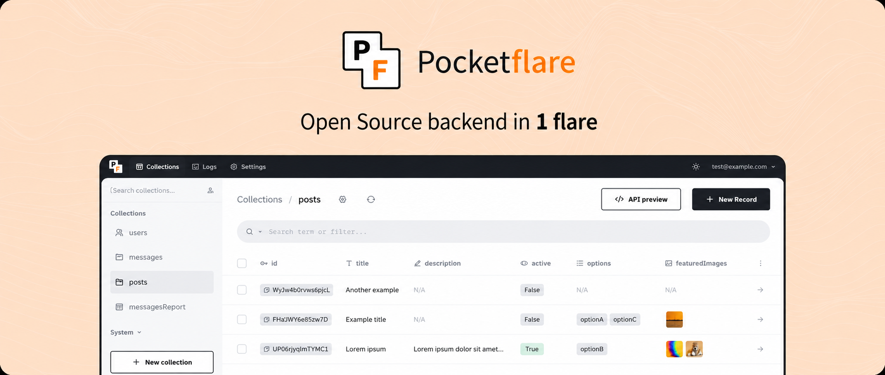

Pocketflare runs [PocketBase] on Cloudflare Workers and includes:

- D1-backed [PocketBase] data instead of an embedded SQLite file
- realtime subscriptions through an optional Durable Object bridge
- built-in files and users management, with file storage backed by R2
- the familiar [PocketBase] Admin dashboard UI, served through Workers Assets
- the simple REST-ish [PocketBase] API, running as Go WASM on Cloudflare Workers

Pocketflare is intentionally a thin port. The goal is not to fork [PocketBase] into a new product; it is to make [PocketBase] work well on Cloudflare while keeping future upstream updates easy to pull. It also keeps your backend portable; you can port back to Pocketbase anytime.

## Quick Start

Scaffold a new Pocketflare project:

```sh
./scripts/scaffold-project.sh
```

The scaffold prompts for the target directory, Go module path, Worker name, app URL, D1 databases, R2 buckets, and whether to create Cloudflare resources through Wrangler. It does not write admin passwords to tracked files.

In the generated project:

```sh
./scripts/update-pb.sh
pnpm install
make deploy
```

`make deploy` builds first, then runs `pnpm exec wrangler deploy`.

## Local Development

Use Wrangler's local dev server for normal iteration. Wrangler runs the Worker in its local Miniflare-backed runtime and stores local D1/R2 state under `.wrangler/`.

From a fresh checkout:

```sh
./scripts/update-pb.sh
pnpm install
make build
make dev
```

Then open:

```text
http://localhost:8787/_pf
```

`/_pf` is Pocketflare's first-run setup route. If the local database has no superuser, it redirects to [PocketBase]'s tokenized first-access installer. After creating the superuser, use `http://localhost:8787/_/` for the admin UI. Local D1/R2 data is separate from Cloudflare remote resources.

After changing Go, `worker.mjs`, `runtime.mjs`, `realtime-do.mjs`, or `smtp-transport.mjs`, stop Wrangler, run `make build`, then run `make dev` again. Admin UI changes require rebuilding `admin-ui/_` before `make build`.

To test against real Cloudflare D1/R2 bindings instead of local Miniflare state:

```sh
make build
pnpm exec wrangler dev --remote
```

Local dev is useful for app behavior and UI checks, but it is not proof of deployed Worker memory behavior. Use a deployed Worker for cold-start, concurrent-browser-request, and edge-runtime validation.

To check whether the pinned [PocketBase] version is current:

```sh
pnpm run check:pb-version
```

## Admin Setup

For a fresh database, deploy and open `/_pf`. Pocketflare redirects to [PocketBase]'s tokenized first-access installer, where you create the first superuser. After setup, use `/_/` for the normal [PocketBase] admin UI.

Headless bootstrap is still supported by setting `POCKETFLARE_ADMIN_EMAIL` and `POCKETFLARE_ADMIN_PASSWORD` in the Worker environment, but it is not the normal path. Remove those values after the first successful boot.

New databases also default:

- app URL from `POCKETFLARE_APP_URL`
- trusted proxy header `CF-Connecting-IP`

Existing or migrated [PocketBase] settings are preserved.

## Runtime Shape

Pocketflare runs [PocketBase] as Go WASM inside a Cloudflare Worker.

| Component | Cloudflare primitive | Purpose |
|---|---|---|
| Dynamic API | Worker + Go WASM | Runs [PocketBase] routes, hooks, auth, collections, and admin APIs. |
| App database | D1 `APP_DB` | Primary [PocketBase] data. |
| Logs database | D1 `LOGS_DB` | [PocketBase] logs and auxiliary data. |
| File storage | R2 `STORAGE` | Uploaded files for [PocketBase] file fields. |
| Backup artifacts | R2 `BACKUPS` | Stores upstream backup zip artifacts when enabled. |
| Admin UI assets | Workers Assets `ASSETS` | Serves `admin-ui/_` without booting Go WASM. |
| Realtime | Optional Durable Object | SSE/WebSocket bridge for [PocketBase] realtime. |

Required bindings in `wrangler.toml`:

```toml
[[d1_databases]]
binding = "APP_DB"

[[d1_databases]]
binding = "LOGS_DB"

[[r2_buckets]]
binding = "STORAGE"

[[r2_buckets]]
binding = "BACKUPS"

[assets]
directory = "./admin-ui"
binding = "ASSETS"
```

`ASSETS` is Cloudflare Workers Assets, not R2. It serves `admin-ui/_` so browser fan-out for admin static files does not boot the Go WASM runtime. Pocketflare's `/_pf` route is the one-time first-superuser setup entry point; `/_` and nested admin assets stay on Workers Assets.

## File Storage

In the Workers build, Pocketflare injects an R2 filesystem adapter and ignores the upstream local/S3 filesystem path for file storage.

Standard [PocketBase] file uploads and downloads are still mediated by the [PocketBase] API. Direct browser-to-R2 uploads and signed R2 download redirects are possible future Pocketflare features, not effects of enabling [PocketBase] S3.

Terminology:

- Upload means a [PocketBase] client posts a file to the [PocketBase] API, then Pocketflare writes it to R2. The current writer is a chunked R2 multipart writer: it buffers up to one part in Go, uploads that part, and releases it. This is bounded-memory pseudo-streaming, not direct browser-to-R2 upload.
- Download means [PocketBase] serves `/api/files/...` through the Worker from R2. Signed R2 redirects and public-bucket delivery are not implemented.
- Copy means [PocketBase]'s filesystem `Copy(src, dst)` method duplicated an existing object. Normal uploads, downloads, and migration imports do not use S3 `CopyObject`.

When optional R2 API credentials are configured, Copy can use server-side S3 `CopyObject` so object bytes do not pass through the Worker. Without those credentials, the fallback relays the source object body to a new R2 object through the Worker without holding the whole file in Go memory. Treat the fallback as needing runtime proof before relying on it for large objects.

## Backups

Use Cloudflare D1 Time Travel or D1 export for database backups, not [PocketBase]'s upstream backup system.

[PocketBase] backups archive the local `pb_data` directory. In Pocketflare, the application database lives in the `APP_DB` D1 binding, logs live in the `LOGS_DB` D1 binding, and uploaded files live in the `STORAGE` R2 binding. Those resources are outside the ephemeral Worker data directory, so an upstream [PocketBase] backup zip is not a complete application backup.

If [PocketBase] backup creation or auto backups are enabled, the resulting zip is stored through the `BACKUPS` R2 binding, but it should not be treated as restorable production data on Pocketflare. Backup restore is unsupported on Workers today.

For production:

- Use D1 Time Travel for point-in-time database restore.
- Export D1 to durable storage when you need backup retention beyond D1 Time Travel's window.
- Back up or copy the `STORAGE` R2 bucket separately for uploaded files.
- Leave [PocketBase] backup S3 settings disabled; they are not the source of truth for Pocketflare backups.

## Email

Pocketflare replaces [PocketBase]'s Go `net/smtp` transport in the Workers build. Mail delivery can use:

- SMTP through Workers sockets
- HTTP provider APIs: `resend`, `postmark`, `sendgrid`, or `mailgun`
- a generic HTTPS webhook

HTTP provider setup:

```sh
pnpm exec wrangler secret put POCKETFLARE_MAIL_API_KEY
```

Set non-secret provider defaults in `wrangler.toml`:

```toml
[vars]
POCKETFLARE_MAIL_PROVIDER = "resend"
```

Generic webhook setup:

```sh
pnpm exec wrangler secret put POCKETFLARE_MAIL_WEBHOOK_URL
pnpm exec wrangler secret put POCKETFLARE_MAIL_WEBHOOK_TOKEN
```

Provider selection priority is `POCKETFLARE_MAIL_PROVIDER`, then `POCKETFLARE_MAIL_WEBHOOK_URL`, then [PocketBase] admin SMTP settings. Use HTTP providers or the webhook for production until SMTP sockets are proven against your provider.

Amazon SES SMTP credentials use a derived SMTP password, not the raw 40-character AWS secret access key. After creating SES SMTP credentials for the same region as your SMTP endpoint, convert the secret locally:

```sh
node scripts/ses-smtp-password.mjs '<aws-secret-access-key>' us-east-1
```

In [PocketBase] SMTP settings, use the `AKIA...` access key ID as the username and the script output as the password. For `email-smtp.us-east-1.amazonaws.com`, use region `us-east-1`.

## Migrate Existing [PocketBase]

1. Scaffold a Pocketflare project.

2. Move your hooks, routes, and migrations into the generated Go app. Register hooks before `router.BuildMux()`.

3. Export SQLite data:

```sh
mkdir -p .artifacts
./scripts/migrate-data.sh /path/to/pb_data/data.db > .artifacts/pocketbase-to-d1.sql
pnpm exec wrangler d1 execute APP_DB --remote --file .artifacts/pocketbase-to-d1.sql
```

4. Upload file storage:

```sh
WRANGLER_R2_BUCKET=<storage-bucket> ./scripts/migrate-files.sh /path/to/pb_data/storage --execute
```

For existing S3-backed [PocketBase] apps, copy the existing `storage/` prefix from the source bucket into the Pocketflare R2 `STORAGE` bucket. See `docs/storage-migration.md`.

5. Deploy:

```sh
make deploy
```

The data export includes `_params/settings`, so migrated app URL and trusted proxy settings are not replaced by Pocketflare defaults.

## Performance Timing

Pocketflare exposes app-level timing headers on dynamic responses:

- `X-Pocketflare-Runtime`: `cold`, `boot_wait`, or `warm`
- `Server-Timing`: `pf_total`, `pf_runtime_wait`, `pf_handler`, and cold-start boot phases

Run:

```sh
node scripts/benchmark-worker.mjs https://<worker-domain> 20
```

On `pocketflare.garage.workers.dev`, immediately after deploy `ad9d0a94-09af-4bb4-9ace-3976693c1643`:

```text
admin asset: 227.48ms client, route=bypassed
first dynamic request: 755.4ms client, runtime=cold
server cold boot: pf_boot_total=239ms, pf_go_ready=239ms
warm dynamic p50: 42.38ms client
warm dynamic p95: 74.78ms client
```

`route=bypassed` means Cloudflare served the admin asset without invoking the Worker script or Go WASM runtime.

## Cost Model

Prices below are estimates from Cloudflare public pricing checked 2026-05-30. Check Cloudflare pricing before making commitments.

Pocketflare currently needs Workers Paid because the deployed bundle is about 8.9 MiB gzip, above the Workers Free 3 MiB gzip limit. The baseline platform cost is therefore the Workers Paid minimum: **$5/month**.

Included in that baseline:

- Workers: 10 million dynamic Worker requests/month and 30 million CPU ms/month.
- D1: 25 billion rows read/month, 50 million rows written/month, and 5 GB storage.
- R2 free tier: 10 GB-month storage, 1 million Class A operations, 10 million Class B operations, and no egress fees.
- Static assets: admin UI files served by Workers Assets are free/unlimited and do not invoke the Worker script.

Typical Pocketflare accounting:

| Action | Worker requests | D1 usage | R2 usage | Pocketflare overhead |
|---|---:|---|---|---|
| Admin static file | 0 | 0 | 0 | Served by Workers Assets. |
| Dynamic API request | 1 | Rows scanned/written by [PocketBase] query | 0 unless file route | Singleton WASM runtime per isolate. |
| First dynamic request in an isolate | 1 | Settings/migrations/route bootstrap reads | 0 | Adds WASM + Go boot once for that isolate. |
| Record create/update | 1 | [PocketBase] row writes plus index writes | Optional if file fields | No extra storage service. |
| File upload | 1 | Record write if attached to record | R2 Class A: usually 1 small put, or multipart parts for large files | Upload bytes pass through Worker. |
| File download | 1 | Access-rule/auth reads | R2 Class B: usually 1 get | Download bytes pass through Worker. |
| Cron tick | 1 per scheduled event | Due-job checks and job work | Job-dependent | Default config runs once per minute, about 43,200 Worker requests/month. |

Realtime/SSE is optional. Without the Durable Object binding, realtime is disabled and costs nothing. With it enabled, Pocketflare uses one named Durable Object hub for SSE transport:

- DO requests: 1 million/month included, then $0.15/million.
- DO duration: 400,000 GB-s/month included, then $12.50/million GB-s.
- One continuously active 128 MB Durable Object is about 324,000 GB-s/month. That fits inside the included Paid allowance if it is your main Durable Object use; priced as overage it would be about $4.05/month.
- Actual realtime cost depends on connected time and event fan-out. Each connection/subscription/message delivery can add DO requests; long-lived SSE connections can keep the DO active.

For a small baseline [PocketBase] app with no realtime and less than 10 GB of files, the expected Cloudflare bill is usually the **$5/month Workers Paid minimum** until product-level database scans, writes, file traffic, or realtime usage exceed included limits.

## Current Limits

- D1 cannot provide SQLite-equivalent multi-statement rollback through `database/sql`; each statement commits independently.
- Batch API requests run through [PocketBase]'s upstream `/api/batch` handler, but they are not atomic on Pocketflare. If one operation in a batch fails, earlier writes in the same batch may already be committed to D1.
- Uploads and downloads still pass through the Worker; direct browser-to-R2 upload and signed R2 download redirects are not implemented.
- R2 filesystem Copy has two paths: server-side `CopyObject` with optional R2 API credentials, or the Worker relay fallback. The fallback and scaffolded bucket-name configuration need runtime proof before large-copy claims.
- Realtime/SSE requires the optional Durable Object binding. Without it, realtime is not supported on Workers.
- [PocketBase] rate limiting uses [PocketBase]'s upstream in-memory limiter. On Workers this is per isolate, not globally shared across isolates or regions. It is useful as best-effort app protection, but use Cloudflare WAF/rate limiting for edge-wide abuse protection. A Durable Object-backed limiter would be needed for globally exact [PocketBase] rate-limit semantics.
- Cron requires the Workers Cron Trigger in `wrangler.toml`; it is not driven by [PocketBase]'s in-process ticker.
- HTTP mail providers and webhook delivery are the production paths. SMTP sockets exist but need provider-level proof, especially STARTTLS on port 587.
- [PocketBase] backups are not complete data backups on Pocketflare because D1 and R2 data live outside `pb_data`. Use D1 Time Travel/export plus a separate R2 file backup plan.

## Cloudflare Limits

Current Worker limits that shape Pocketflare:

- Memory is 128 MB per isolate, including JavaScript heap and WASM allocations. A single isolate can handle many concurrent requests, so admin static assets must stay on Workers Assets and not boot Go WASM.
- Worker size is 3 MB gzip on Free and 10 MB gzip on Paid, with a 64 MB uncompressed limit.
- Startup time is 1 second for global-scope parse and execution.
- Request body size is a Cloudflare account-plan limit, not a Workers-plan limit: 100 MB on Free/Pro, 200 MB on Business, and 500 MB by default on Enterprise. Standard [PocketBase] uploads still pass through the Worker, so this applies until direct R2 upload exists.
- Static Asset files can be up to 25 MiB each.

## References

- Cloudflare Workers limits: https://developers.cloudflare.com/workers/platform/limits/
- Cloudflare Workers pricing: https://developers.cloudflare.com/workers/platform/pricing/
- Cloudflare Durable Objects pricing: https://developers.cloudflare.com/durable-objects/platform/pricing/
- Cloudflare D1 pricing: https://developers.cloudflare.com/workers/platform/pricing/#d1
- Cloudflare D1 Time Travel: https://developers.cloudflare.com/d1/reference/time-travel/
- Cloudflare D1 import/export: https://developers.cloudflare.com/d1/best-practices/import-export-data/
- Cloudflare R2 pricing: https://developers.cloudflare.com/r2/pricing/
- Cloudflare R2 upload methods: https://developers.cloudflare.com/r2/objects/upload-objects/

[PocketBase]: https://github.com/pocketbase/pocketbase
